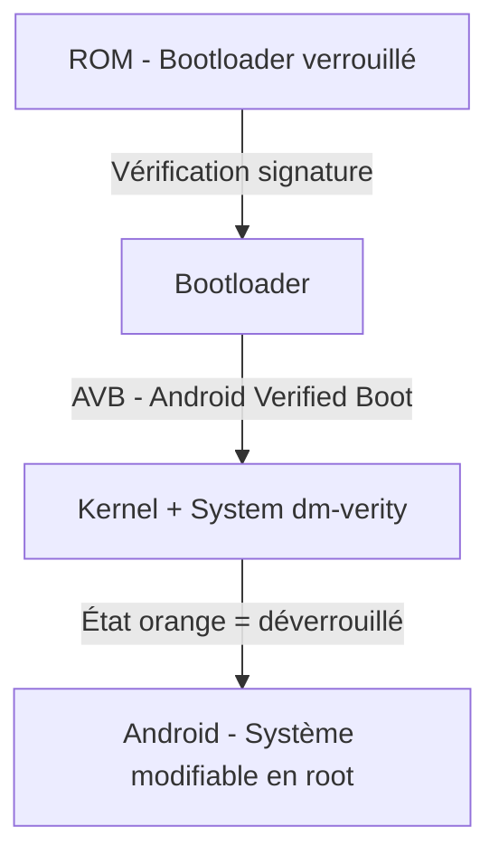

#  Lab-2-rootage : Rooting Android - Pixel 6.2 AVD
**Rapport complet de pentest mobile - Comprendre le rooting et ses impacts**

---

## Fiche Périmètre

- **App + version** : Android OS (Pixel 6.2 writable-system)  
- **Support** : AVD – Émulateur Android Studio (Android Virtual Device)  
- **Objectif** : Comprendre rooting et impacts  
- **Données** : Fictives  
- **Réseau** : Test  

---

## Définition du Rooting (4 phrases)

Le rooting est l’obtention des droits administrateur (UID 0) sur un appareil Android.  
Il permet de contourner toutes les restrictions imposées par le fabricant et le système d’exploitation.  
Une fois rooté, l’utilisateur peut modifier ou supprimer n’importe quel fichier système, installer des modules système ou contourner les protections sandbox.  
C’est l’équivalent Android du « jailbreak » sur iOS ou du passage en administrateur sur Windows.

---

## Schéma simple – Chaîne de confiance Verified Boot / AVB

Matrice de risques (8 risques)

Perte totale de la garantie constructeur
Exposition des données sensibles (clés API, mots de passe)
Installation plus facile de malwares/rootkits persistants
Blocage des mises à jour OTA officielles
Détection et blocage par les apps bancaires
Risque de brick (appareil inutilisable)
Contournement des protections SELinux et sandbox
Risque légal en environnement professionnel

Mesures défensives (8 mesures)

Réseau isolé pour éviter toute communication non contrôlée
Données fictives uniquement
Device/AVD dédié exclusivement aux tests
Snapshots ou wipe complet en fin de séance
Journal de configuration détaillé
Aucun compte personnel utilisé
Contrôle strict des APK installées
Horodatage + captures systématiques

OWASP MASVS – 2 exigences résumées

STORAGE-1 : Les données sensibles doivent être stockées avec chiffrement approprié.
NETWORK-1 : Toutes les communications doivent utiliser TLS avec validation stricte des certificats.

OWASP MASTG – 2 idées de tests

Vérifier si l’application détecte le root (su, Magisk, /system rw) et bloque les fonctionnalités.
Intercepter le trafic HTTPS après installation d’un certificat CA rooté.

Preuves techniques
Capture 1 – Verified Boot State = orange

Capture 2 – Mobexler : adb root + remount succeeded

Capture 3 – Fastboot en attente (limitation émulateur)

Capture 4 – uid=0(root) + disable-verity + reboot

Capture 5 – Application de test en cours d’exécution sur l’AVD rooté

Fiche Environnement

Type : AVD Pixel 6.2 writable-system (Android Studio)
Version Android : 14
Root : Activé (uid=0(root))
Verity : Désactivé (verity is already disabled)
Verified Boot State : orange
Accès : ADB root + remount rw
Preuve log : logcat_root_check.txt généré

Checklist Finale
Début

 Périmètre écrit
 AVD neuf
 App de test installée
 Versions notées

Fin

 Données de test supprimées
 Reset/wipe effectué
 Preuves du reset sauvegardées
 Rapport + traçabilité sauvegardés
 Aucun compte personnel utilisé

Signature : yassie – 01 mars 2026
